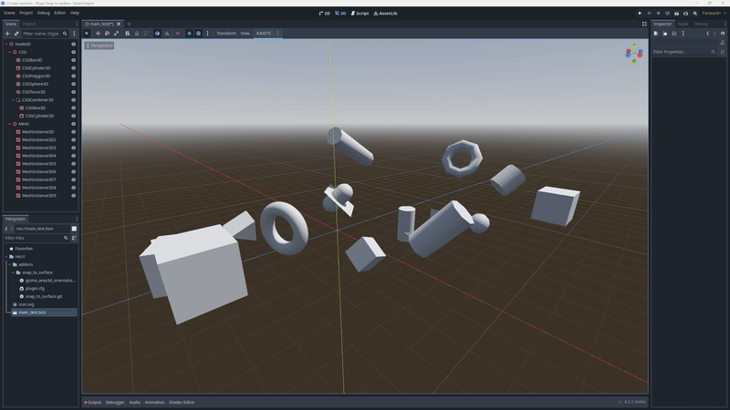

## Brief
	Create a new Area3D object or move a selected 3D object to the selected face.

    

	https://youtu.be/cKMojPDtndo

## References
	https://github.com/remorse107/vertexsnap/blob/master/addons/vertexsnap/plugin.gd
	https://docs.godotengine.org/en/stable/index.html

